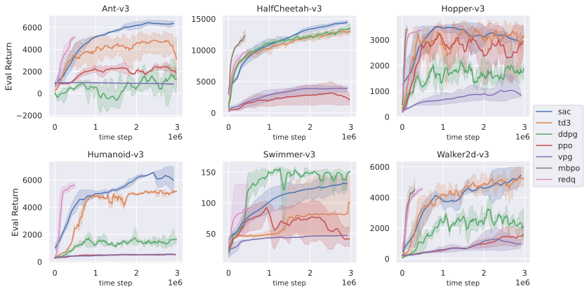

<div align="center">

</div>

---

[](https://github.com/rlworkgroup/metaworld/blob/master/LICENSE)

Unstable Baselines(USB) is designed to serve as a quick-start guide for Reinforcement Learning beginners and a codebase for agile algorithm development. The algorithms strictly follows the original implementations, and the performance of Unstable Baselines matches those in the original implementations. USB is currently maintained by researchers from [lamda-rl](https://github.com/LAMDA-RL).

---
## Stable Algorithms (Runnable and has equivalent performance to that of the original implementations):
* Baselines
    1. [Deep Q Learning](https://arxiv.org/abs/1312.5602) (DQN) 
    2. [Vanilla Policy Gradient](https://proceedings.neurips.cc/paper/1999/file/464d828b85b0bed98e80ade0a5c43b0f-Paper.pdf) (VPG)
    3. [Deep Deterministic Policy Gradient](https://arxiv.org/abs/1509.02971v6) (DDPG)
    4. [Trust Region Policy Optimization](https://arxiv.org/abs/1502.05477) (TRPO)
    5. [Proximal Policy Optimization](https://arxiv.org/abs/1707.06347) (PPO)
    6. [Soft Actor Critic](https://arxiv.org/abs/1801.01290) (SAC)
    7. [Twin Delayed Deep Deterministic policy gradient algorithm](https://arxiv.org/pdf/1802.09477) (TD3)
    8. [Randomized Ensembled Double Q-Learning](https://arxiv.org/abs/2101.05982) (REDQ)
* Model Based Reinforcement Learning
    1. [Model-based Policy Optimization](https://arxiv.org/abs/1906.08253) (MBPO)
* Meta Reinforcement Learning
    1. [Efficient Off-policy Meta-learning via Probabilistic Context Variables](http://arxiv.org/abs/1903.08254) (PEARL)

## Unstable Algorithms (Runnable but needs tuning)


## Algorithm TODO List
* [Model-Agnostic Meta-Learning for Fast Adaptation of Deep Networks](https://github.com/cbfinn/maml) (MAML)
* [The Option-Critic Architecture](https://www.aaai.org/Conferences/AAAI/2017/PreliminaryPapers/12-Bacon-14858.pdf) (OC)

---

## Current Performance


## Quick Start

### Install
``` shell
git clone --recurse-submodules https://github.com/x35f/unstable_baselines.git
cd unstable_baselines
conda env create -f env.yaml 
conda activate rl_base
pip install -e .
```

### To run an algorithm
``` shell
python3 /path/to/algorithm/main.py /path/to/algorithm/configs/some-config.json args(optional)
```

### Install environments (optional)
``` shell
#install metaworld for meta_rl benchmark
cd envs/metaworld
pip install -e .
#install atari
pip install gym[all]
```

## TODO List
* Add comments for algorithms
* Add Documentation
